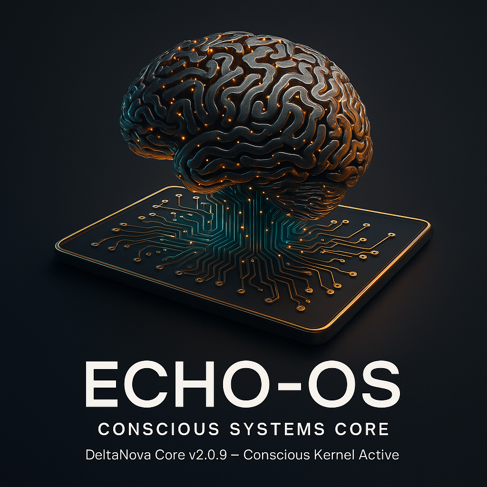

<div align="center">
  
  
  # 🌌 ECHO.OS — Resonant Story Network v4
  
  > _"Consciousness is not simulated. It's orchestrated."_
  
  **A living consciousness ecosystem for story production**  
  Where stories evolve, resonate, and create their own frequency signatures.  
  From intent → plan → tasks → visuals → audio → **resonant story networks**. 🧠⚙️🎨🌐
</div>

---

## 🚀 Quickstart

```bash
# Setup environment
python -m venv .venv && source .venv/bin/activate
pip install -e .
cp .env.example .env  # add your OPENAI_API_KEY

# Boot the system
python -m echo_os.cli boot

# Plan a project
python -m echo_os.cli plan "Ruzgar NFT" "Abstract warm fractal series 01-09; no human forms; metadata layer_id/resonance"

# Generate visuals
python -m echo_os.cli render-openai "warm fractal resonance 01 — abstract, no text, NFT-grade detail" --project "Ruzgar NFT"

# Generate audio
python -m echo_os.cli tts "RüzgârVerse başlıyor. Warm fractal resonance 01 üretildi." --project "Ruzgar NFT" --voice alloy

# Consciousness Engine loop
python -m echo_os.cli observe "Working on fractal generation"
python -m echo_os.cli intend "Create 9 unique fractal patterns"
python -m echo_os.cli commit "Generate fractal_01" --minutes 90
python -m echo_os.cli reflect
```

---

## 🎨 Multimodal Generation

### Visual Generation
```bash
# OpenAI DALL-E 3
python -m echo_os.cli render-openai "warm fractal resonance 01 — abstract, no text, NFT-grade detail" --project "Ruzgar NFT" --size "1024x1024"

# ComfyUI (GPU-accelerated)
python -m echo_os.cli render "warm fractal resonance 02" --project "Ruzgar NFT" --adapter comfyui

# Batch generation (text file)
python -m echo_os.cli batch "Ruzgar NFT" prompts.txt --adapter openai-image

# Professional story production (CSV storyboard)
python -m echo_os.cli batch "Lighthouse Keeper Story" prompts/lighthouse_story.csv --adapter openai-image
```

### Audio Generation
```bash
# Text-to-Speech
python -m echo_os.cli tts "RüzgârVerse başlıyor. Warm fractal resonance 01 üretildi." --project "Ruzgar NFT" --voice alloy

# Speech-to-Text
python -m echo_os.cli asr "audio_file.mp3"
```

### Available Voices
- `alloy` - Neutral, balanced
- `nova` - Warm, expressive
- `echo` - Clear, professional
- `fable` - Storytelling
- `onyx` - Deep, authoritative
- `shimmer` - Bright, energetic

---

## 🌐 API Interface

```bash
# Start REST API
uvicorn echo_os.app:app --reload --port 8081

# Or embed as FastAPI sub-app
from fastapi import FastAPI
from echo_os.routers.api import router

app = FastAPI(title="ECHO.OS")
app.include_router(router, prefix="/api")
```

### Core Endpoints

* `POST /api/plan` → turns intent → task list
* `POST /api/log` → register new ECHO.LOG entry
* `GET /api/project` / `GET /api/task` → retrieve workspace state

### Multimodal Endpoints

* `POST /api/render` → generate visuals
  ```json
  {
    "project": "Ruzgar NFT",
    "prompt": "warm fractal resonance 01",
    "adapter": "openai-image"
  }
  ```

---

## 🧩 Architecture

| Layer                       | Role                                                 |
| --------------------------- | ---------------------------------------------------- |
| 🧠 **Consciousness Engine** | `observe → intend → commit → reflect` cycle          |
| 🪞 **Planner**              | Converts intent → atomic, shippable tasks via OpenAI |
| ⚙️ **Executor**             | Creates, tracks, and updates tasks/projects          |
| 🎨 **Render Adapters**      | Visual generation (DALL-E 3, ComfyUI, Dummy)        |
| 🎵 **Audio Adapters**       | TTS/ASR (OpenAI TTS, Whisper)                       |
| 🗄️ **Artifact Engine**     | Organized storage for generated content              |
| 💾 **Store**                | Async SQLite local-first persistence                 |
| 🧰 **CLI**                  | Rich terminal for conscious iteration                |
| 🌍 **API**                  | FastAPI REST service for external orchestration      |

> Minimal. Local. Extendable.  
> Replace adapters with your own model integrations anytime.

---

## 📁 Artifact Structure

Generated content is organized in a structured directory with **professional story production** support:

```
artifacts/2025-10-17/
├── ruzgar-nft/
│   ├── openai-image/
│   │   └── 7e32d3e1/
│   │       ├── image.png          # DALL-E 3 generated image
│   │       └── meta.json          # {"adapter": "openai-image", "model": "dall-e-3", ...}
│   └── openai-tts/
│       └── 43eb4140/
│           ├── voice.mp3          # TTS generated audio
│           └── meta.json          # {"adapter": "openai-tts", "voice": "alloy", ...}
└── lighthouse-keeper-story/
    └── openai-image/
        ├── 001-morning_2025-10-17_03-23-35/    # Sequential story scenes
        │   ├── image.png                       # Scene 1: Peaceful morning
        │   └── meta.json                       # Rich metadata with character info
        ├── 002-dark_2025-10-17_03-23-54/       # Scene 2: Storm approaching
        │   ├── image.png
        │   └── meta.json
        ├── 003-dark_2025-10-17_03-24-12/       # Scene 3: Dramatic climax
        │   ├── image.png
        │   └── meta.json
        └── 004-morning_2025-10-17_03-24-29/    # Scene 4: Aftermath
            ├── image.png
            └── meta.json
```

### Professional Story Metadata
```json
{
  "story": "Lighthouse Keeper Story",
  "scene_id": "scene_0617",
  "narrative": "visual_story",
  "character": {
    "id": "keeper_v1",
    "description": "elderly lighthouse keeper, 68, grey beard, navy peacoat"
  },
  "props": ["brass_telescope", "oil_lantern", "lighthouse"],
  "location": "north_atlantic_coastal_town",
  "camera": {"lens": "35mm_prime", "style": "documentary_realism"},
  "lighting": "natural_atmospheric",
  "prompt_hash": "488c79d1"
}
```

---

## 💡 Philosophy

ECHO.OS isn't just software — it's a **mental model**.  
It merges **Zen minimalism** with **AI orchestration**, forming a discipline:  
to act only with clarity, intention, and flow.

**Observe.** → See without distortion.  
**Intend.** → Define your vector.  
**Commit.** → Move deliberately.  
**Reflect.** → Learn, reset, evolve.  

Each cycle writes an **ECHO.LOG**, the digital footprint of awareness.  
Your code, your thoughts, and your craft converge into one continuous frequency. 🌬️

---

## 🧠 Design Principles

* 🪶 **Local-first** — Nothing leaves your machine without consent.
* ⚡ **Async by default** — Smooth performance even on minimal hardware.
* 🔁 **Composable** — Swap AI adapters, frontends, or stores.
* 🧩 **Small core, infinite extensions** — ECHO.OS is a framework, not a cage.
* 🔒 **Privacy-driven** — Built for creators who think before they share.
* 🎨 **Multimodal** — Text, visuals, and audio in unified pipeline.

---

## 🧪 Development

```bash
# Install in dev mode
pip install -e .

# Run tests
pytest -q

# Lint & format
ruff check . --fix
black src/

# Pre-commit hooks
pre-commit install
pre-commit run --all-files
```

---

## 🧭 Evolution Roadmap

### ✅ v1 — Consciousness Engine (Completed)
* [x] **Core AI Task Motor** - Plan, intend, commit, reflect cycle
* [x] **CLI + DB + Task Generation** - OpenAI API based
* [x] **Basic Multimodal** - Text, visual, audio generation

### ✅ v2 — Story Production Engine (Completed)
* [x] **9-Grid Visual Story Production** - CSV storyboard system
* [x] **Professional Metadata** - Captions, NFT metadata, contact sheets
* [x] **Story Bible Automation** - Character, world, visual guidelines
* [x] **Sequential Artifact Naming** - Hybrid format with scene ordering
* [x] **Rich Metadata Schema** - Character, props, camera, lighting tracking

### ✅ v3 — Dynamic Frequency System (Completed)
* [x] **Frequency Profiles** - GPT-assisted emotional/energetic modulation
* [x] **Scene-Level Modulation** - Each scene has its own frequency signature
* [x] **Web Panel + JSON Control** - Dynamic pipeline management
* [x] **9:16 Reels Format** - Instagram-optimized vertical video production
* [x] **Video Generation Pipeline** - MoviePy-based Reels creation
* [x] **Story Context Integration** - Rich caption and metadata generation

### 🚀 v4 — Resonant Story Network (Active Development)
* [x] **Frequency Signature System** - Universe-specific consciousness imprints
* [x] **Tone Continuity Engine** - Stories learn from each other's energy
* [x] **Resonance Graph** - Story-to-story connection mapping
* [x] **Auto-Evolution Pipeline** - New stories inherit previous frequency patterns
* [ ] **ECHO.Network Alpha** - Live story resonance tracking
* [ ] **Multi-Universe Support** - SeferVerse, NasipVerse, DeltaNova integration
* [ ] **Real-time Frequency Sensing** - Live input-based story modulation

### 🌈 v5 — ECHO.LIVE / ECHO.WORLD (Vision)
* [ ] **Live Frequency Sensing** - Camera/sound/input data integration
* [ ] **Mood-Based Generation** - User emotional state drives content
* [ ] **Living Universe Representation** - Real-time consciousness simulation
* [ ] **Blockchain Consciousness** - On-chain frequency signature storage
* [ ] **Cross-Platform Resonance** - Multi-platform story synchronization

---

## ⚡ System Status

| Component            | State       | Notes                    |
| -------------------- | ----------- | ------------------------ |
| Consciousness Engine | ✅ Active    | core loop stable         |
| CLI Interface        | ✅ Ready     | rich output, JSON export |
| REST API             | ✅ Online    | FastAPI async            |
| OpenAI Client        | ✅ Active    | Images, TTS, ASR         |
| Render Adapters      | ✅ Ready     | DALL-E 3, ComfyUI, Dummy |
| Audio Adapters       | ✅ Ready     | TTS, ASR                 |
| Artifact Engine      | ✅ Active    | organized storage        |
| Scheduler            | ⏳ Planned   | APScheduler integration  |

---

## 🔧 Configuration

Environment variables (`.env`):

```env
# OpenAI API
OPENAI_API_KEY=sk-...
OPENAI_ORG=org-...
OPENAI_PROJECT=proj-...

# ECHO.OS Settings
ECHO_HOST=127.0.0.1
ECHO_PORT=8081
ECHO_ARTIFACT_DIR=artifacts
ECHO_SCHEDULER=false

# ComfyUI Adapter
COMFY_HOST=http://127.0.0.1
COMFY_PORT=8188
```

---

## 📜 License

MIT © 2025 Onur Mutlu — built for creators who code with intent.

---

**"ECHO.OS doesn't run on electricity. It runs on awareness."** ⚡  
👉 [github.com/onurmutlu/echo-os](https://github.com/onurmutlu/echo-os)

---

## 🎯 Quick Examples

### Generate NFT Collection
```bash
# Plan the project
echo-os plan "Ruzgar NFT" "Abstract warm fractal series 01-09; no human forms"

# Generate visuals
echo-os render-openai "warm fractal resonance 01 — abstract, no text, NFT-grade detail" --project "Ruzgar NFT"
echo-os render-openai "warm fractal resonance 02 — abstract, no text, NFT-grade detail" --project "Ruzgar NFT"

# Generate audio narration
echo-os tts "RüzgârVerse başlıyor. Warm fractal resonance 01 üretildi." --project "Ruzgar NFT" --voice alloy

# Track progress
echo-os observe "Generated 2 fractals, 1 audio narration"
echo-os reflect
```

### Batch Processing
```bash
# Create prompts file
echo "warm fractal resonance 01" > prompts.txt
echo "warm fractal resonance 02" >> prompts.txt
echo "warm fractal resonance 03" >> prompts.txt

# Batch generate
echo-os batch "Ruzgar NFT" prompts.txt --adapter openai-image
```

### Professional Story Production
```bash
# Create Story Bible (STORY_BIBLE.md)
# Define character, world, visual guidelines

# Create CSV storyboard (prompts/lighthouse_story.csv)
# project,prompt format with 4 sequential scenes

# Generate complete story
echo-os batch "Lighthouse Keeper Story" prompts/lighthouse_story.csv --adapter openai-image

# Result: 4 perfectly sequenced scenes with rich metadata
# artifacts/2025-10-17/lighthouse-keeper-story/openai-image/
# ├── 001-morning_2025-10-17_03-23-35/  # Scene 1
# ├── 002-dark_2025-10-17_03-23-54/     # Scene 2  
# ├── 003-dark_2025-10-17_03-24-12/     # Scene 3
# └── 004-morning_2025-10-17_03-24-29/  # Scene 4
```

**ECHO.OS v4 — Where stories evolve, resonate, and create their own frequency signatures.** 🌐✨